# Spatio-Temporal Analysis of Dengue Cases in Brazil

# Abstract

Dengue fever, a mosquito-borne viral infection, poses a significant public
health challenge in many tropical and subtropical regions, including Brazil.
This study investigates the spatio-temporal dynamics of dengue incidence in
Brazil between 2015 and 2019, examining the variation across 557 microregions
and months, and assessing the association with climatic covariates such as
temperature, Palmer Drought Severity Index (PDSI), and piped water
availability. The research aims to enhance our understanding of factors
influencing dengue spread in Brazil and inform targeted intervention
strategies.

The analysis reveals a positive association between minimum temperature and
dengue incidence, with a relative risk (RR) of 1.14 (95% CI 1.13 - 1.16) for a
1-degree increase in temperature, mixed associations for PDSI, and no
association with piped water availability. Furthermore, the study uncovers
temporal patterns and spatial clustering of dengue incidence across all
models, identifying the Goiânia microregion as particularly susceptible to a
strong spatial effect (RR 31.03 [95% CI 22.51 - 42.79]). Spatio-temporal
modelling estimates demonstrate shifting dengue risk patterns between 2017 and
2019. In summary, the study emphasizes the coexistence of a Brazil-wide
spatial and temporal component alongside a distinct region-dependent temporal
component, indicating a complex spatio-temporal dynamic to dengue incidence.

# Introduction

Dengue fever, an acute infectious disease caused by the dengue virus, is
transmitted to humans through the bite of infected Aedes mosquitoes. Brazil
has witnessed a substantial increase in dengue incidence, alongside other
mosquito-borne diseases like Zika and Chikungunya, in recent years. In 2022,
Brazil experienced an unprecedented surge in dengue-related fatalities,
potentially marking a historic peak (Piovezan 2023). Factors such as climate,
urbanization, and seasonality influence the spatio-temporal dynamics of these
diseases. As climate change potentially impacts disease dynamics, deciphering
the relationship between climatic variables and dengue incidence is crucial
for public health planning and disease prevention initiatives.

This study aims to investigate the spatio-temporal dynamics of dengue
incidence in Brazil between 2015 and 2020, focusing on the variation in dengue
incidence across 557 microregions and months, and the association with
climatic covariates such as temperature, Palmer Drought Severity Index (PDSI),
and piped water availability. In addition, the analysis aims to examine the
potentially microregion-specific temporal dynamics of dengue incidence. The
findings of this research will contribute to a better understanding of the
factors influencing the spread of dengue in Brazil and provide valuable
insights for targeted intervention strategies to mitigate the impact of this
debilitating disease.

# Methods

Microregions are defined by the Brazilian Institute of Geography and
Statistics. (“IBGE | Censo 2010” n.d.) Monthly dengue incidence data have been
obtained from the Ministry of Health Information Department (“DATASUS
Ministério da Saúde” n.d.). Climatic covariate information (referred to
henceforth as CC), including minimum temperature and Palmer’s Drought Severity
Index (PDSI), are available in monthly resolution by microregion and have been
sourced from the Climatic Research Unit (CRU) (“Climatic Research Unit \-
Groups and Centres” n.d.). Percentage access to the piped water network is
derived from the 2010 Brazilian census (“IBGE | Censo 2010” n.d.). A median
split was performed on this variable, creating a new derived variable that
differentiates areas with water availability above and below the median value.
It should be noted that the PDSI for the Fernando de Noronha microregion is
unavailable, resulting in its exclusion from subsequent analysis.

The inclusion of PDSI and temperature as covariates is supported by previous
studies demonstrating the influence of temperature and rainfall patterns on
seasonal dengue transmission (Lowe et al. 2021). Additionally, high human
population density and inadequate water supply (requiring water storage) are
considered major contributors to dengue epidemics (Gubler et al. 2001),
supporting the inclusion of piped water availability.

The analytical plan involves several stages. First, the geographic and
temporal distribution of the covariates and raw incidence rates of dengue
across Brazil (averaged across all time points) will be visualized. Second, a
spatio-temporal analysis will be conducted of the relationship between dengue
incidence across Brazil, geographic region, and time between the years of 2015
- 2019. This will be accomplished by fitting five consecutive Bayesian spatio-
temporal models with inclusion of the three aforementioned covariates.

The posterior distributions of the coefficients, spatial, and temporal
components across each model will be inspected and the expected values
visualised in the appropriate domain. The expected value of the ϕϕ
hyperparameter will be inspected and compared across models to provide an
estimate of the degree of spatial clustering. Finally, the Watanabe-Akaike
Information Criterion (WAIC) will be compared across the models to help
identify the model with the best balance between complexity and fit. The
results from the aforementioned analyses will be investigated and commented
upon.

## Model specifications

The observed value (ie., observed number of dengue cases), in common with
every subsequent model is the following:

Oit∼Poisson(ρit×popit105)Oit∼Poisson(ρit×popit105)

The spatio-temporal models to be fitted are specified as follows:

  1. A BYM2 spatial model and a linear time trend (t being the month from the onset of study), referred to as _ST-LT_ :

logρit=b0+bi+CTitβ+βttlog⁡ρit=b0+bi+CitTβ+βtt

  2. A BYM2 spatial model, a linear time trend (t being the month from the onset of study), and an unstructured time component, referred to as _ST-LUT_ :

logρit=b0+bi+CTitβ+βtt+ψtlog⁡ρit=b0+bi+CitTβ+βtt+ψt

  3. A BYM2 spatial model and a RW1 structured time trend, referred to as _ST-ST_ :

logρit=b0+bi+CTitβ+γtlog⁡ρit=b0+bi+CitTβ+γt

  4. A BYM2 spatial model, a RW1 structured time trend, and an unstructured time component, referred to as _ST-SUT_ :

logρit=b0+bi+CTitβ+γt+ψtlog⁡ρit=b0+bi+CitTβ+γt+ψt

  5. A BYM2 spatial model, a RW1 structured time trend, an unstructured time component, and a Type I space-time interaction component, referred to as _ST-SUT-INT_ :

logρit=b0+bi+CTitβ+γt+ψt+δitlog⁡ρit=b0+bi+CitTβ+γt+ψt+δit

Variables above are defined as:

bβψtγtδit=∼∼∼∼1τb−−√(1−ϕ−−−−−√v∗+ϕ−−√u∗)N(0,σ2β)N(0,σ2ψ)RW(1)N(0,σ2δ)b=1τb(1−ϕv∗+ϕu∗)β∼N(0,σβ2)ψt∼N(0,σψ2)γt∼RW(1)δit∼N(0,σδ2)

The spatial random effect is modelled assuming a BYM2 specification. BYM2
combines an intrinsic CAR (ICAR) prior and a standard normal prior to allow
for structured local (uu) and unstructured global (vv) smoothing,
respectively:

viu∼∼N(0,σ2v)ICAR(W,σ2u)vi∼N(0,σv2)u∼ICAR(W,σu2)

The temporal random effect is modelled as a random walk of order 1 in order to
allow for observations to be dependent on those immediately temporally
preceding it.

Hyperprior distributions are further specified for τbτb, ϕϕ, and σ2γσγ2; these
are the precision parameters controlling the marginal variance of the spatial
random effect, the mixing parameter (ie., the proportion of the marginal
variance explained by the spatial effect), and the conditional variance of the
temporal random effect, respectively. These hyperpriors are defined as
Penalised Complexity (PC) priors, as suggested in the literature. (Moraga
n.d.)

Analysis was performed in R (v4.2.1) and with the R-INLA software package
(v22.12.16) (Rue 2023).

# Results

## I. Preliminary insights

The data available allows us to observe the number of dengue cases in Brazil
per year. We are also able to visualise the geographic distribution of the raw
incidence of dengue and its incidence by region across time. Similarly, we may
visualise the covariates across time (sans water availability, as this
variable is constant through time). Regional and temporal distributions of the
covariates are available in the Supplement.

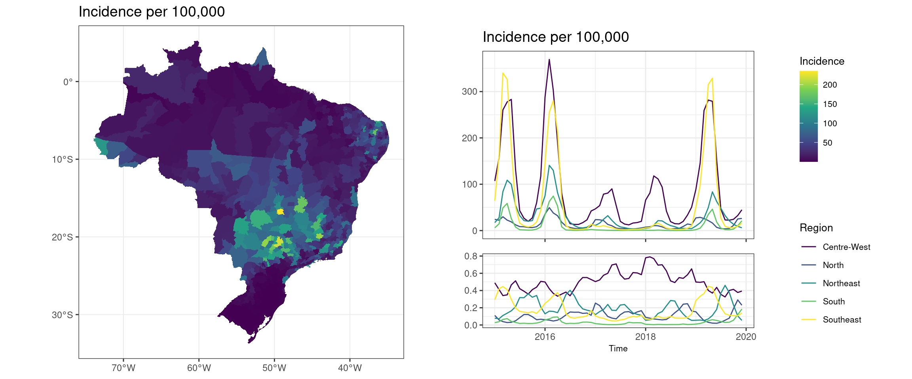

## II. Result visualisation

### Fixed effects:

After fitting the models, we can derive the posterior means and 95% credible
intervals (CI) for the ββ coefficients across each model. The outcomes are
generally consistent across models, with the most significant discrepancy
being the differing signs of the PDSI coefficient. Considering the _ST-SUT-
INT_ model, the RR associated with a 1 degree increase in temperature is 1.14
(CI 95% 1.13 \- 1.16) and with a 1 unit increase in PDSI the RR is 0.97 (CI
95% 0.96 - 0.98). This model shows larger credible intervals for the latter
two variables compared to other models. The 95% CI of the coefficient for
water availability crosses an RR of 1 for all models. Lastly, when comparing
the two models that include a linear temporal term, it is evident that the
model with an unstructured temporal component demonstrates a substantially
broader credible interval for the coefficient representing the months since
the study began. A forest plot is available in the Supplement.

### Random effects:

For the simple linear model, visualisation of the posterior means of the
unstructured temporal component was performed to assess for temporal structure
which may not have been captured in the linear term. Across all models
incorporating a structured temporal component, γiγi, visualisation of its
posterior mean (RR) was performed for assessment. These plots may be found in
the Supplement.

We may also obtain regional plots of the posterior means of the spatial RR,
bibi, across each model. In the interest of space, we will only compare the
model with structured and unstructured spatio-temporal elements to the model
with an additional interaction term. Notably, the highest spatial RR from the
interaction model was Goiânia with an RR of 31.03 (95% CI 22.51 - 42.79). In
addition, the spatial fraction was obtained from the mean of the posterior
distribution for the ϕϕ hyperparameter. Tables of the spatial fraction and
further visual representations of the spatial RR across all models can be
found in the Supplement.

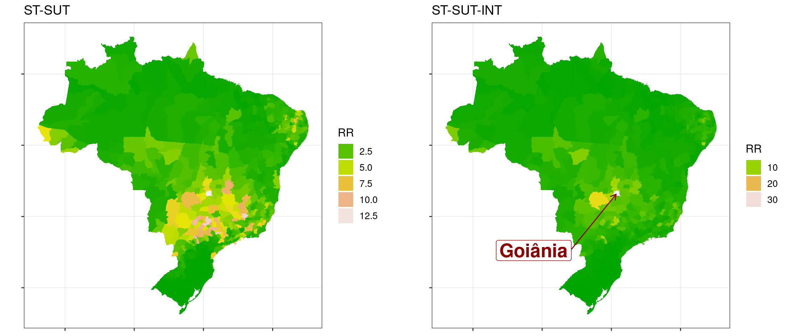

Furthermore, we can observe the posterior mean of the interaction effect, δδ,
from the spatio-temporal interaction model. The results are averaged over the
months of each year. Only the regional plots from the years 2017 and 2019 are
displayed here for brevity’s sake: (see Supplement)

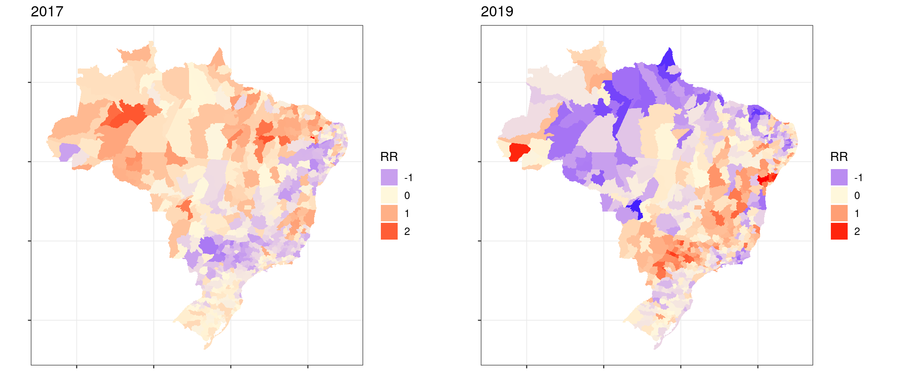

Finally, we compare model performance with the Watanabe–Akaike information
criterion (WAIC). The model including the interaction term scored the lowest
(195,728 vs. 21,613,936, the second lowest). (see Supplement)

# Discussion and conclusion

#### Fixed effects

Our findings highlight the limitations of linear models in capturing temporal
associations with dengue occurrence, as the unstructured temporal random
effect reveals a distinct seasonal pattern.

Consistent with previous research, our study confirms the correlation between
increased minimum temperature and dengue incidence, supporting the notion that
warmer conditions contribute to a rise in dengue cases (Bambrick, Woodruff,
and Hanigan 2009).

Interestingly, while prior research suggests a connection between increased
moisture levels and dengue incidence, our study only found a positive
association between higher PDSI and dengue incidence in the model without a
random temporal component. This discrepancy could be attributed to the random
effects’ capture of the temporal components in drought indices, resulting in
divergent effect estimates.

Across all models, we observed that the percentage of water availability did
not seem to have a notable association with dengue incidence. This is a
surprising result, given that existing evidence indicates a link between
increased water storage and dengue incidence (Schmidt et al. 2011). It is
possible that this discrepancy arises from dengue incidence reflecting drought
conditions and subsequent water storage rather than access to piped water per
se.

Lastly, it is noteworthy that the credible intervals for PDSI and temperature
in the interaction model are generally wider compared to those in other
models. This phenomenon is likely due to the interaction term capturing
similar region and temporally-dependent metrics.

#### Random effects

The simple linear temporal model’s unstructured component exposes a temporal
pattern not captured by a basic linear trend. By incorporating a structured
temporal component, modeled as a first-order random walk, we successfully
account for the strong nationwide temporal aspect of dengue incidence in
Brazil (e.g., season-related). Our study also highlights a notable decrease in
dengue incidence across all regions during the 2017-2018 Zika outbreak period,
aligning with existing literature (Zambrana et al. 2018).

Our analysis across all models consistently reveals spatial clustering of
dengue incidence, as evidenced by visual inspection of spatial relative risk
(RR) graphs and the spatial mixing hyperparameter, ϕϕ. The Goiânia
microregion, in particular, was estimated to have a strong separable spatial
effect. This reflects recent reports of this microregion experiencing the
highest confirmed cases of dengue in the country in 2022 (n.d.).

Furthermore, spatio-temporal interaction estimates can be observed by
visualizing its posterior probability, averaged by year, and examining the
spatial clustering patterns. In 2017, a relatively higher dengue risk is
evident in the Northern regions of Brazil compared to the rest of the country.
However, by 2019, the risk shifts towards the Central-West region, while the
Northern area experiences a relatively lower risk. This additional information
carried by the interaction is further reflected in the regional and temporal
plots of the spatial and temporal RRs by the interaction models’ reduction in
contribution to the respective separable components, driven by spatio-temporal
discongruity. Finally, we can observe that the model containing the Type I
spatio-temporal interaction performs better than the separable models by
noting the significantly lower WAIC.

#### Limitations

Investigating dengue fever holds significant importance for both public health
interventions and future research directions. By revealing the coexistence of
nationwide and region-specific spatio-temporal components in Brazil’s dengue
incidence, this study highlights the complex interplay between environmental
factors and disease dynamics. However, limitations such as the limited number
of factors considered, a lack of peri-Brazilian data coverage for more
accurate spatial modeling, and temporally granular water availability data
call for further investigation. Additionally, the discrepancies from the
literature concerning the water availability-dengue relationship (Schmidt et
al. 2011) emphasize the need for context-specific public health interventions
and more advanced modeling techniques to capture complex relationships.

The insights gained from this study can inform targeted vector control
strategies and underscore the potential impact of climate change on dengue
distribution. To build upon our understanding of disease transmission
dynamics, future research should incorporate additional factors, investigate
other vector-borne diseases, and employ non-linear or machine learning models,
as recommended by (Lowe et al. 2011) and (Guo et al. 2017). By deepening our
knowledge of the factors influencing the spread of dengue and other vector-
borne diseases in Brazil, we can better equip public health authorities to
design and implement more effective interventions, ultimately mitigating the
impact of these debilitating diseases on affected communities.

# Supplement

## Covariates and dengue incidence

Covariates and dengue incidence plotted over time:

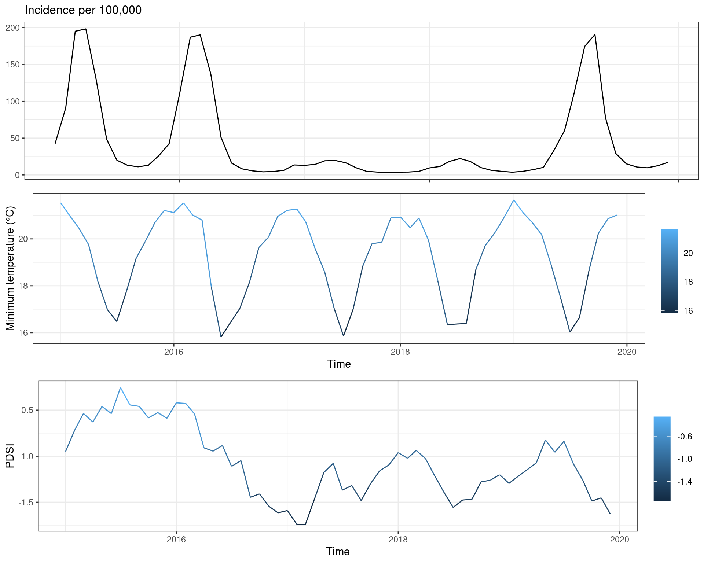

Covariates and dengue incidence plotted in space:

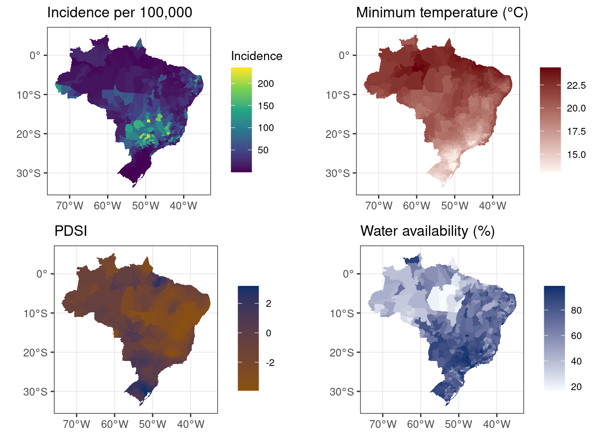

## Fixed effects

### Posterior distributions (log RR)

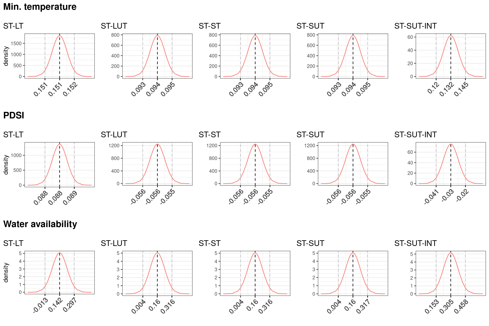

### Forest plots (RR)

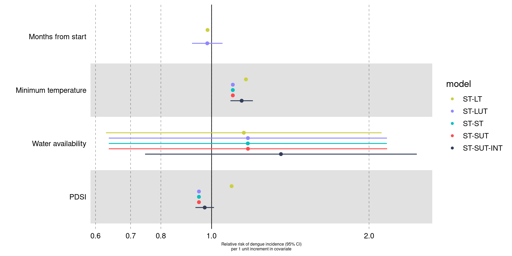

## Random effects

### Temporal random effects

Unstructured temporal term in simple linear model:

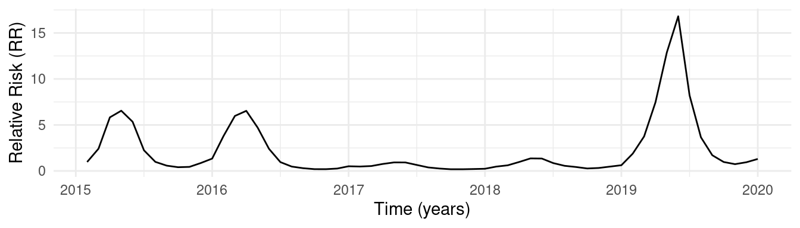

Plots of temporal random effects across each model (RR):

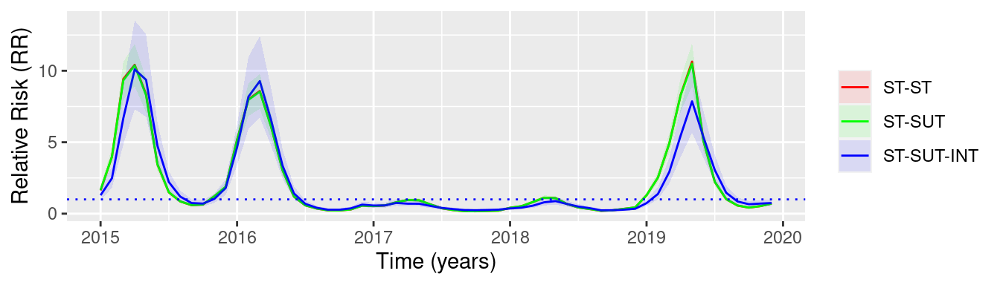

### Spatial random effects

Spatial RR across all models:

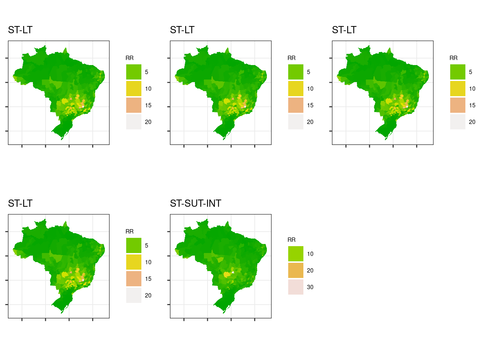

### Interaction effects

Spatio-temporal interaction effect RR (averaged per year):

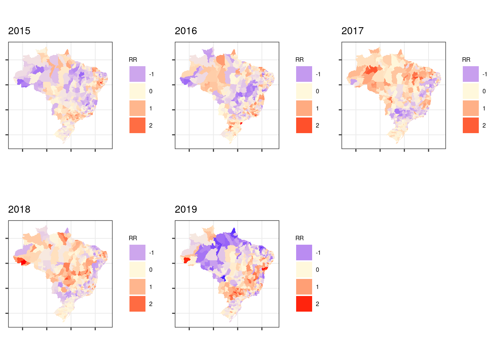

### Mixing parameter (ϕϕ)

Table of spatial mixing parameter (per BYM2) across each model:

Posterior mean of phi per model  Model  |  ϕϕ  
---|---  
ST-LT  |  0.845  
ST-LUT  |  0.961  
ST-ST  |  0.962  
ST-SUT  |  0.958  
ST-SUT-INT  |  0.839  
  
### WAIC

WAIC per model  Model  |  WAIC  
---|---  
ST-LT  |  95237808  
ST-LUT  |  21615488  
ST-ST  |  21613936  
ST-SUT  |  21614770  
ST-SUT-INT  |  195728  
  
# References

Bambrick, Hilary J., Rosalie E. Woodruff, and Ivan C. Hanigan. 2009. “Climate
Change Could Threaten Blood Supply by Altering the Distribution of Vector-
Borne Disease: An Australian Case-Study.” _Global Health Action_ 2 (1): 2059.
<https://doi.org/10.3402/gha.v2i0.2059>.

“Climatic Research Unit \- Groups and Centres.” n.d.
https://www.uea.ac.uk/groups-and-centres/climatic-research-unit. Accessed
April 3, 2023.

“DATASUS Ministério da Saúde.” n.d. Accessed April 3, 2023.

Governo de Goiás. n.d. “Portal Goiás \- Goiás é o 2 Estado Do País Em Mortes
Por Dengue.”
https://www.goias.gov.br/servico/35-saude/126975-goi%C3%A1s-%C3%A9-o-segundo-
estado-do-pa%C3%ADs-em-n%C3%BAmero-de-mortes-por-dengue.html. Accessed April
3, 2023.

Gubler, D J, P Reiter, K L Ebi, W Yap, R Nasci, and J A Patz. 2001. “[Climate
Variability and Change in the United States: Potential Impacts on Vector- and
Rodent-Borne Diseases.](https://www.ncbi.nlm.nih.gov/pmc/articles/PMC1240669)”
_Environmental Health Perspectives_ 109 (Suppl 2): 223–33.

Guo, Pi, Tao Liu, Qin Zhang, Li Wang, Jianpeng Xiao, Qingying Zhang, Ganfeng
Luo, et al. 2017. “Developing a Dengue Forecast Model Using Machine Learning:
A Case Study in China.” _PLoS Neglected Tropical Diseases_ 11 (10): e0005973.
<https://doi.org/10.1371/journal.pntd.0005973>.

“IBGE | Censo 2010.” n.d. https://censo2010.ibge.gov.br/. Accessed April 3,
2023.

Lowe, Rachel, Trevor Bailey, David Stephenson, Richard Graham, Caio Coelho,
Marilia Carvalho, and Christovam Barcellos. 2011. “Spatio-Temporal Modelling
of Climate-Sensitive Disease Risk: Towards an Early Warning System for Dengue
in Brazil.” _Computers & Geosciences_ 37 (March): 371–81.
<https://doi.org/10.1016/j.cageo.2010.01.008>.

Lowe, Rachel, Sophie A. Lee, Kathleen M. O’Reilly, Oliver J. Brady, Leonardo
Bastos, Gabriel Carrasco-Escobar, Rafael de Castro Catão, et al. 2021.
“Combined Effects of Hydrometeorological Hazards and Urbanisation on Dengue
Risk in Brazil: A Spatiotemporal Modelling Study.” _The Lancet Planetary
Health_ 5 (4): e209–19. <https://doi.org/10.1016/S2542-5196(20)30292-8>.

Moraga, Paula. n.d. _Chapter 5 Areal Data | Geospatial Health Data: Modeling
and Visualization with R-INLA and Shiny_. Accessed April 3, 2023.

Piovezan, Stefhanie. 2023. “Brazil Breaks Record of Deaths Caused by Dengue in
2022.” _Folha de S.Paulo_.
https://www1.folha.uol.com.br/internacional/en/scienceandhealth/2023/01/brazil-
breaks-record-of-deaths-caused-by-dengue-in-2022.shtml.

Rue, Håvard. 2023. “R-INLA.”

Schmidt, Wolf-Peter, Motoi Suzuki, Vu Dinh Thiem, Richard G. White, Ataru
Tsuzuki, Lay-Myint Yoshida, Hideki Yanai, et al. 2011. “Population Density,
Water Supply, and the Risk of Dengue Fever in Vietnam: Cohort Study and
Spatial Analysis.” _PLoS Medicine_ 8 (8): e1001082.
<https://doi.org/10.1371/journal.pmed.1001082>.

Zambrana, José Victor, Fausto Bustos Carrillo, Raquel Burger-Calderon, Damaris
Collado, Nery Sanchez, Sergio Ojeda, Jairo Carey Monterrey, et al. 2018.
“Seroprevalence, Risk Factor, and Spatial Analyses of Zika Virus Infection
After the 2016 Epidemic in Managua, Nicaragua.” _Proceedings of the National
Academy of Sciences of the United States of America_ 115 (37): 9294–99.
<https://doi.org/10.1073/pnas.1804672115>.

